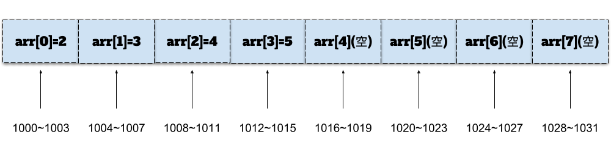
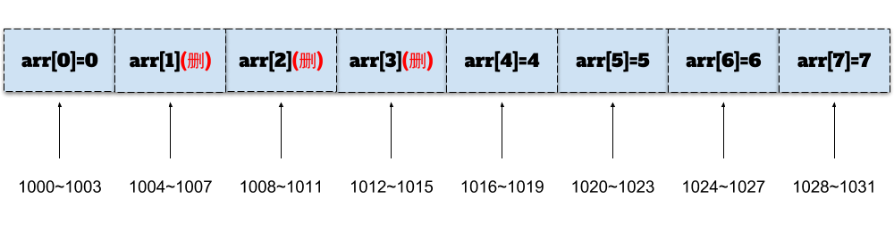
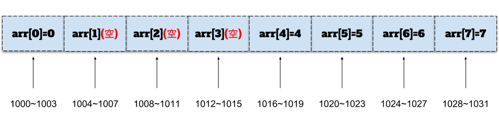

# 数组

## 数组的定义

&emsp;&emsp;数组数据结构（英语：array data structure），简称数组（英语：Array），是由相同类型的元素（element）的集合所组成的**线性表**数据结构，分配一块连续的内存来存储。利用元素的索引（index）可以计算出该元素对应的存储地址。[^维基百科（略改动）]


## 数组的特性

&emsp;&emsp;数组是依赖连续的内存空间来实现快速的读取任意元素的，所以数组在使用前需要给定请求空间，这使得数组有一下特性：

* 数组的长度一旦定义则不能改变，否则会有溢出问题
* 需要连续的内存空间（这意味着，分配给数组的内存空间将不会再有其他程序占用）

比如我们申请了一个长度为8且每个元素占用4个字节（比如整型）的一维数组：

```javascript
// 针对V8引擎，不推荐这种写法
var arr = new Array(8);
for(let i = 0; i < arr.length; i++) {
    arr.push(i);
}
```

那么，这个一位数组在内存中的表现如图（根据不同JavaScript引擎，内部实现会各不同）：


## 数组寻址

&emsp;&emsp;在计算程序中，都是通过内存地址来访问内存中的数据，而程序会给数组分配连续的内存空间，所以当我们基于数组下标任意获取数组中的某个元素时，会非常高效。

&emsp;&emsp;比如上图中，我们需要取出arr[7]中数据，每个元素占用4个字节，从索引为0开始查找第8个元素为1028

```
1028 = 1000 + 7 * 4;
```

&emsp;&emsp;我们假设首地址为base，字节占用大小为size，那么数组中第k个元素的寻址公式为：

```
arr[k] = base + k * size;
```

&emsp;&emsp;为了便于理解，我们引入ES6的一个新的集合来模拟这个结构：

```javascript
// 为了便于理解而进行的模拟，请勿用于开发中
var arr = new Map();
arr.set([1000, 1001, 1002, 1003], 0); // 模拟连续的四个内存存储一个整形的数据
arr.set([1004, 1005, 1006, 1007], 1);
arr.set([1008, 1009, 1010, 1011], 2);
arr.set([1012, 1013, 1014, 1015], 3);
arr.set([1016, 1017, 1018, 1019], 4);
arr.set([1020, 1021, 1022, 1023], 5);
arr.set([1024, 1025, 1026, 1027], 6);
arr.set([1028, 1029, 1030, 1031], 7);
/*
// 或者用for循环
var base = 1000,
    size = 4;
for(let i = 0; i < 8; i++) {
  let addresses = [],
      start = base + i * size; 
  addresses.push(start, start + 1, start + 2, start + 3);
  arr.set(addresses, i);
}
*/
```

&emsp;&emsp;顺便给出二维数组的寻址公式（假设一个p * q的数组，首地址为base，字节占用大小为size，获取数组中第j组第k个元素）：

```
arr[j][k] = base + (j * q + k) * size;
```

&emsp;&emsp;根据数组下标进行查找是非常高效的，记住：**这是是根据数组下标查找，而不是根据数组元素查找**


## JavaScript模拟数组

&emsp;&emsp;为了便于学习和理解，我们用JavaScript来模拟数组这样一个数据结构，实际上只需要引入三个东西，

&emsp;&emsp;&emsp;&emsp;1. 存储数组元素的容器，可以用JavaScript的数组`[]`或者对象`{}`

&emsp;&emsp;&emsp;&emsp;2. 数组容器的容量，也就是数组元素的最大个数的限制（基于C89标准数组是不允许可变长数组的）

&emsp;&emsp;&emsp;&emsp;3. 数组元素的个数

&emsp;&emsp;为了简化，我们引入几个约定

&emsp;&emsp;&emsp;&emsp;1. undefined代表空元素（empty），也就是当前数组中没有元素

&emsp;&emsp;&emsp;&emsp;2. null代表标记为删除的元素(实际尚未删除，只是标记删除，等数组存储满了，会进行清除)

&emsp;&emsp;&emsp;&emsp;3. 存储的元素类型为number

```javascript
/*
 * ⚠️代码仅供学习数据结构和算法，不可用在生产环境
 * 约定：
 *   1、undefined代表空元素，也就是当前数组中没有元素
 *   2、null代表标记为删除的元素，实际尚未删除，只是标记删除，等数组存储满了，会进行清除
 * 有序数组
 */
class ArrayData {
  /*
   * 构造函数
   * @param max {int}  数组元素的最大个数，也就是数组容器的最大容量
   */
  constructor(max) {
    // 存储数组元素的容器，可以是{}，也可以是[]
    this.items = {}; // this.items = [];
    // 数组元素的最大个数，也就是数组容器的最大容量
    this.max = max;
    // 数组元素的个数
    this.length = 0;
  }
}
```

&emsp;&emsp;模拟数组时，我们根据数组元素的规律性将数组分为有序数组和无序数组。


## 有序数组

&emsp;&emsp;有序素组就是数组中的元素按照一定的规律排列，那么在根据元素查找时，可以充分的利用这一特性选择适合的算法，比如**二分查找**（相对比较高效，后面我们会讲排序算法会讲到）。

&emsp;&emsp;**优点**：基于元素/索引的查找相对较快（基于索引的查找非常快）

&emsp;&emsp;**缺点**：基于元素/索引的插入和删除相对较慢

#### 插入

&emsp;&emsp;我们来看一下元素的插入操作，比如有一个元素个数为n的数组，需要将一个元素插入第i个位置，为了给即将插入的这个元素腾出空间，我们首先需要将i ~ (n - 1)位置中元素全部右移1位，然后再将元素插入i这个位置。

&emsp;&emsp;举个例子，假设有一个长度为8的数组，已经存储了4个元素，现在插入一个元素3.1：

```javascript
var arr = new OrderArray(8);
arr.add(2);
arr.add(3);
arr.add(4);
arr.add(5);
// 再插入一个3.1
arr.add(3.1);
```

&emsp;&emsp;我们来看看插入3.1时发生了什么？该数组如下图：



&emsp;&emsp;那么当我们插入3.1这个元素时，需要分三步：

&emsp;&emsp;&emsp;&emsp;1. 遍历对比大小，找到这个元素可以插入的位置，这个位置为arr[2]


&emsp;&emsp;&emsp;&emsp;2. 将arr[2]~arr[3]右移1位


&emsp;&emsp;&emsp;&emsp;3. 在arr[2]插入3.1


#### 删除

&emsp;&emsp;后面我们讲了排序算法以后，我们再来讨论如何基于元素去进行删除操作；现在我们先来看一下基于索引的删除操作；同样如上，比如有一个长度为n的数组，需要删除第i个位置的元素，这时我们首先需要将(i + 1) ~ (n - 1)位置中的元素全部左移1位，然后将(n - 1)位置的元素置为空。

&emsp;&emsp;接着上面的例子，我们将arr[1]的元素删除，需要两步：

&emsp;&emsp;&emsp;&emsp;1. 将arr[2]~arr[4]的元素左移1位


&emsp;&emsp;&emsp;&emsp;2. 将arr[4]置空


## 无序数组

&emsp;&emsp;有序素组就是数组中的元素按照一定的规律排列；照此推理，那么无序数组就是数组中的元素没有规律，是一种无序的状态。

&emsp;&emsp;**优点**：基于索引的快速插入和删除

&emsp;&emsp;**缺点**：基于元素的查找相对较慢（基于索引的查找非常快）

#### 插入

&emsp;&emsp;我们来看一下无序数组的元素插入操作，同样比如有一个元素个数为n的数组，需要将一个元素插入第i个位置，有序数组是将i ~ (n - 1)位置的元素全部右移1位，然后再将元素插入i这个位置；那么无序数组本身就是无序状态，我们可以对此进行优化，将第i个位置的元素放到数组的最后，然后在i的位置插入元素。

&emsp;&emsp;举个例子，假设有一个长度为8的数组，已经存储了4个元素，现在在第1的位置插入一个元素10：

```javascript
var arr = new DisorderArray(8);
arr.add(0, 8);
arr.add(1, 9);
arr.add(2, 7);
arr.add(3, 5);
// 再在第1的位置插入一个10
arr.add(1, 10);
```

&emsp;&emsp;我们来看看第1的位置插入10这个元素时发生了什么，该数组如下图：


&emsp;&emsp;那么当我们在第1的位置插入10这个元素时，需要分两步：

&emsp;&emsp;&emsp;&emsp;1. 将第1位置的元素9移动当前数组的最后


&emsp;&emsp;&emsp;&emsp;2. 将元素插入第1的位置


#### 删除

&emsp;&emsp;我们再来看一下基于索引的删除操作，对于个数为n的数组，如若需要删除第i个位置的元素，有序数组需要将(i + 1) ~ (n - 1)位置中的元素进行左移1位，然后将(n - 1)置空的操作；对于无序数组，我们引入一个垃圾回收算法常用的标记清除法来实现。

&emsp;&emsp;来看具体的例子，现在有一个长度为8的数组，为了便于理解，假设目前该数组已经存满了8个元素：

```javascript
var arr = new DisorderArray(8);
for(let i = 0; i < 8; i++) {
  arr.add(i, i);
}
// 删除第1，2，3位置的元素
arr.remove(1);
arr.remove(2);
arr.remove(3);
// 在第0个位置插入元素1
arr.add(0, 1);
```

&emsp;&emsp;现在我们删除第1，2，3位置的元素，然后在第0个位置插入一个元素1，该数组如下图：


&emsp;&emsp;首先，我们来看删除操作，删除第1，2，3位置的元素，只需要将第1，2，3位置标记为删除状态即可，而不是真正的删除元素：



&emsp;&emsp;接下来，我们需要在第0个位置新插入一个元素1，那么在插入之前需要先做一个工作就是清除标记为删除的元素，清理工作需要两步：

&emsp;&emsp;1、将需要标记为清除的位置置为空



&emsp;&emsp;2、进行左移置换操作


&emsp;&emsp;完成清理工作后插入工作就跟上面的插入一样了，这里不再赘述。

&emsp;&emsp;到此，数组的数据结构基础基础概念就说完了，这里讲的数组更多的是独立于语言底层实现的，为了便于理解也没有更多的涉及算法（比如数组中基于元素的查找，后面我们会进一步讨论），用JavaScript来模拟主要是为了前端同学更好的理解；如果你觉得意犹未尽，想要进一步了解JavaScript中数组的更多细节，请移步[Wiki](https://github.com/wangweiwei/data_structures_and_algorithms_for_f2e/wiki/JavaScript%E4%B8%AD%E7%9A%84%E6%95%B0%E7%BB%84)


<!-- Reference -->

[^维基百科（略改动）]: https://zh.wikipedia.org/wiki/%E6%95%B0%E7%BB%84
